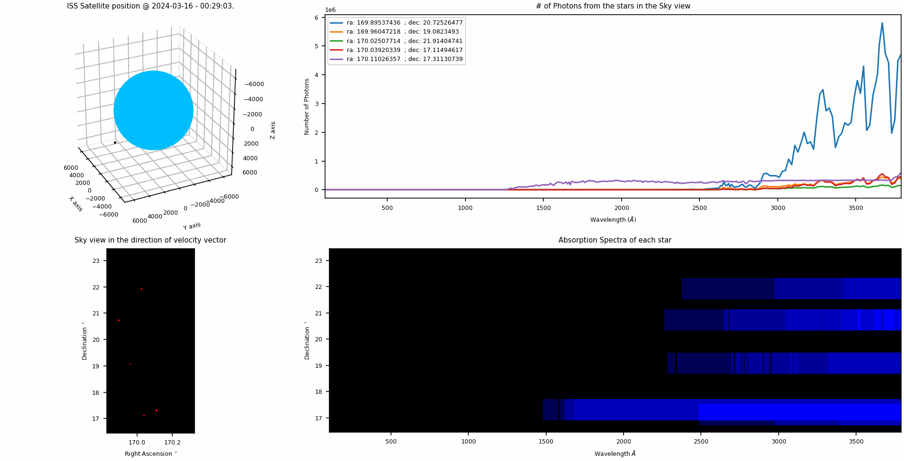

# Spectroscopic data animation of the starfield view from a satellite in Earth orbit
> Animated plot of the starfield as viewed in the velocity direction of a satelitte using TLE propagated data.  
> Obtains the details for stars in Field of View  and their intrinsic stellar spectra then plots Number of photons recieved vs wavelegth, and the Absorption Spectra of the FOV light

## Table of contents
* [General info](#general-info)
* [Screenshots](#screenshots)
* [Setup](#setup)
* [How to run](#How)
* [Parameter File](#parameter)
* [Code Files](#functions)
* [Updates](#updates)
* [To-do list](#to-do)

## Screenshots
Animated plots generated by the script.    

1.  Animation Demo for ISS 
 

&nbsp;   

## General info
A parameter file [init_parameter.txt](./init_parameter.txt) is created using configparser module of python by running [Params_configparser.py](./Params_configparser.py)) file.   
&nbsp;  
As the satellite moves around the orbit, the sky view rendered as seen by a camera positioned in the direction of velocity vector.  
TLE (Two-Line Elements) is used for calculating positions around orbit. For any given valid satellite in space, TLE's can be acquired from [Celestrak](https://celestrak.org/NORAD/documentation/gp-data-formats.php) using its NORAD id.  
TLE of the satellites can be added to the parameter file [Satellite_TLE.txt](./Satellite_TLE.txt) using the creator Python file [Satellite_configparser.py](./Satellite_configparser.py).  
&nbsp;   
Hipparcos Catalogue  [hip_main.dat](./hip_main.dat) is used for star details and the fields extracted are  
Field H1: Hipparcos number  
Field H5: V magnitude    
Fields H8–9:  The right ascension, α , and declination, δ (in degrees)  
Field H11: Trigonometric Parallax  
Field H37: Johnson B-V color  
Field H76: Spectral Type  
&nbsp;  
We obtain the stellar spectra from THE STELLAR ATMOSPHERE MODELS BY CASTELLI AND KURUCZ 2004  [Castelli](./Castelli)
we calculate the star's temperature and effective gravity using its spectral type. 
We assume all stars have the same metal abundance = solar metallicity(P00 files).
&nbsp;   
Jayant Murthy's code: ascl:1512.012  
We converted the following functions into python and used them in our code  
1. GET_STAR_TEMP
2. READ_CASTELLI_SPECTRA
3. GET_SPECTRA
4. GET_SCALE_FACTOR
&nbsp;  
      

## Method   
1.  Satellite position and velocity is calculated from TLE propagation using [sgp4](https://pypi.org/project/sgp4/) library at the current time. 
2.  Right Ascension(RA) and declination(DEC) are derived from the velocity vector after certain regular time intervals which represents 1 frame.   
3.  Retrieve those star details that falls within a threshold magnitude and a Field of View defined by the camera.
4.  Obtain the starlight function (Intrinsic spectra) for each star in the FOV, Scale it to Number of photons recieved per area of detector.
5.  Plot and animate the satellite position around the earth and the starfield view as seen by the satellite.
6.  Plot the number of photons vs wavelength for all stars per FOV
7.  Plot absorption spectra for star light as it would look like spread over a spectroscopic detector.
&nbsp;    

## Setup
Script is written with python (Version: 3.10.6) on linux. Additional modules required:   

* numpy       (tested with Version: 1.21.5 )
* matplotlib  (tested with Version: 3.5.1 )
* pandas      (tested with Version: 1.3.5 )
* math
* sgp4        (tested with Version: 2.21 )
* datetime
* configparser
* astropy.io

## How to run   
* Verify and install required modules
* Specify the location of the local folder on your system where the script is stored, in "get_folder_loc" function of [view_orbit.py](./view_orbit.py)  
* run `python view_orbit.py`. 

## Parameter File
1. [Satellite_TLE.txt](./Satellite_TLE.txt)   
   Contains TLE for all satellites with their specified names in format:
     
         sat_name = Astrosat  
         line1 = 1 40930U 15052A   24006.16340880  .00001943  00000-0  17423-3 0  9998
         line2 = 2 40930   5.9997  85.2473 0008613 282.4744  77.4420 14.78268977447249  
   I reccomend editing this parameter file using the satellite_configparser.py file, which already contains TLE for 'ISS', 'Astrosat', 'RISAT-2B', 'OBJECT A' and it autoupdates parameter file when view_orbit.py is run.
&nbsp;  
 
3. [init_parameter.txt](./init_parameter.txt)  
   has the following configurable parameters:
   
         hipparcos_catalogue = C:\Users\Akshank Tyagi\Documents\GitHub\spg-iiap-UV-Sky-Simulation\\hip_main.dat (#location of the Hipparcos file)  
         castelli_data = C:\Users\Akshank Tyagi\Documents\GitHub\spg-iiap-UV-Sky-Simulation\\Castelli\ckp00  (#location of the Castelli file)
         sat_name = ISS (#Satellite name as given in Satellite_TLE.txt)  
         roll = False (#Roll state of Satellite)  
         roll_rate_hrs = False   
         number of revolutions = 1 (#portion of orbit of the satellite Satellite)  
         n_frames = False (#either give number of frames or t_slice)  
         t_slice = 100 (#Time between two frames)  
         width = 0.5 (#Detector Slit dimensions degree RA)  
         height = 7 (#Detector Slit dimensions degree Dec)  
         star_mag_threshold = 8 (#Apparent magnitude threshold of stars that we want to look at)  
         limit_min = 100 (#Min Wavelength limit in A for observed band, can range{90.9, 1.6e+6})   
         limit_max = 3800 (#Min Wavelength limit in A for observed band, can range{90.9, 1.6e+6})    
         azm = 40  
         ele = 25  
         longitudinal_spectral_width = 0.8 (#Width of Absorption spectra from a star in degrees Dec)
         interval_bw_frames = 1000 (#Time between displaying of two frames in milisec)   
   again it is reccomended to edit this parameter file using the Params_configparser.py, which autoupdates the parameter file when view_orbit.py is run.  
&nbsp;
## Code Files
1. [view_orbit.py](./view_orbit.py)
   
2. [star_data.py](./star_data.py)
3. [star_spectrum.py](./star_spectrum.py)
4. [plot.py](./plot.py)
5. [star_data.py](./star_data.py)
6. [Satellite_configparser.py](./Satellite_configparser.py)

## Updates   
*   Updating to obtain diffused UV background in the Field of View with Zodiacal light and Cosmic UV Background.
*   *  

## To-do list
* 
